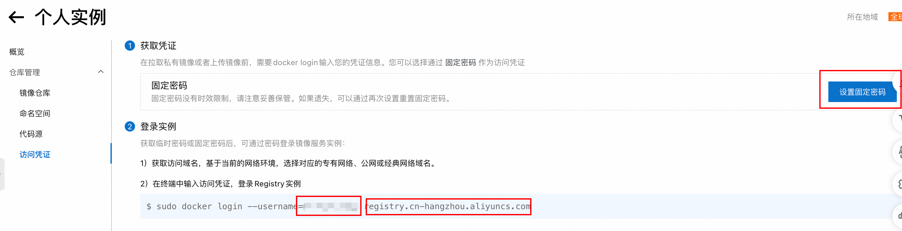
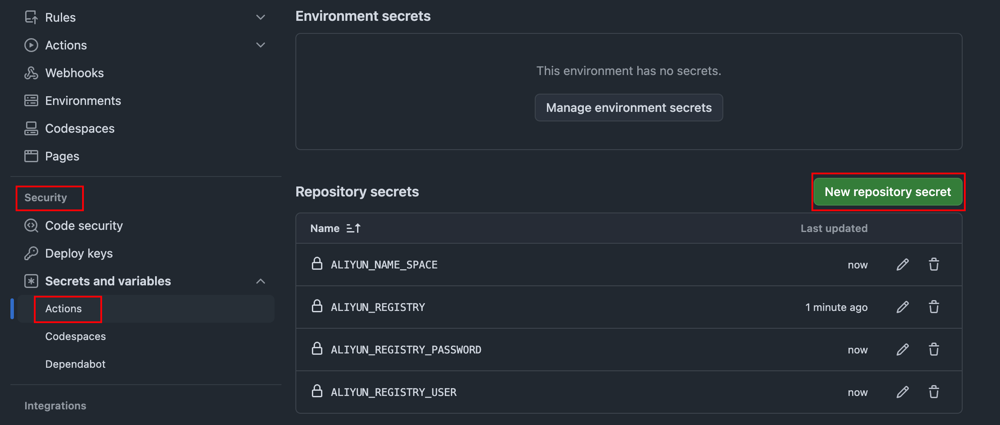

# docker-image-copy
使用Github Action将Docker镜像转存到阿里云镜像仓库。

* 支持docker hub、k8s.io、ghcr.io等仓库
* 支持多架构镜像，如果源镜像支持多架构，则转存所有系统/架构的镜像到同一个镜像名。
* 支持任意大小的镜像(理论)，实测转存了6G的pytorch镜像

## quickstart

### 准备配置

进入[阿里云容器镜像服务](https://cr.console.aliyun.com/)，选择个人版实例，点击仓库管理-命名空间，创建命名空间(**ALIYUN_NAME_SPACE**)

点击访问凭证，设置固定密码(**ALIYUN_REGISTRY_PASSWORD**)



并在下方查看，用户名(**ALIYUN_REGISTRY_USER**)以及仓库地址(**ALIYUN_REGISTRY**)

### 配置github action

fork本项目，在你自己的项目中，点击settings-security-actions，将上述提到的4个secrets配置到项目中。



### 运行action

修改images.txt文件，填入希望转存的镜像，一行一个。

```
# 这是注释
pytorch/pytorch:2.5.0-cuda12.4-cudnn9-devel
# 不指定tag则使用latest
nginx
```

推送代码，github会自行运行action，在action中可以查看进度。

## reference

* [skopeo镜像工具](https://github.com/containers/skopeo)
